# Prism

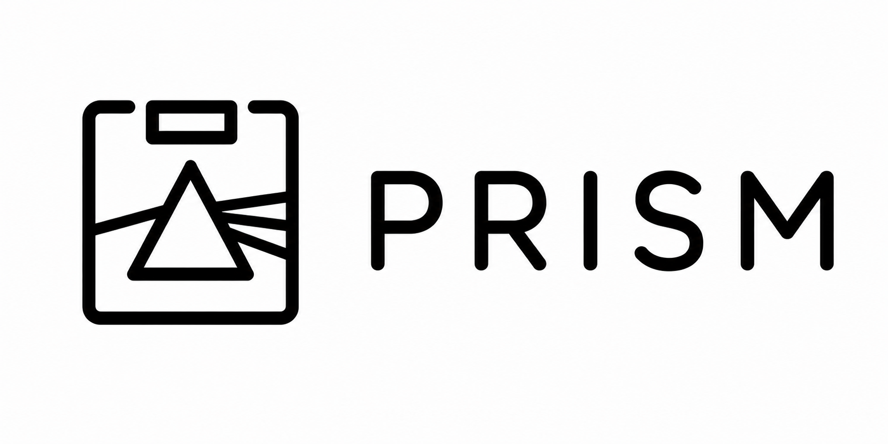
### (Pipeline Review and Image State Monitor)


Prism is a lightweight OCIO image viewer built for fast visual inspection, transform validation, and A/B comparison workflows.

It was created from a very practical need: quickly loading images, testing colorspace transforms, comparing outputs, and debugging OCIO behavior without having to launch a full compositing or grading application.

Prism focuses on still-image workflows and immediate visual feedback:

* compare two images side-by-side
* wipe between transforms
* inspect differences
* validate looks and context variables
* probe pixel values
* and quickly iterate on OCIO decisions

The goal is not to replace tools like Nuke, RV, or Resolve.

The goal is to provide a focused, lightweight environment for color pipeline inspection and experimentation, especially during look development, pipeline debugging, config validation, and day-to-day production support.

Built with:

* PySide6
* OpenColorIO
* OpenImageIO
* NumPy

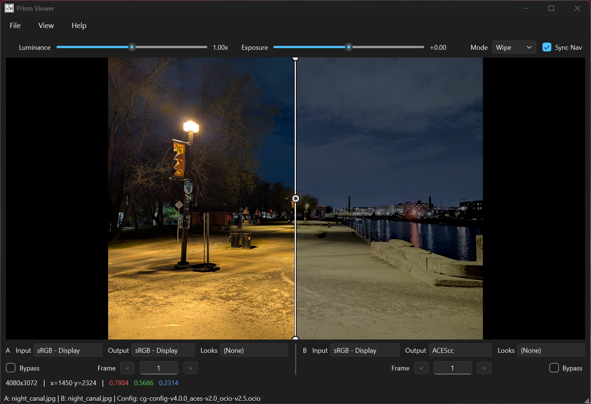

---

# Why Prism Exists

Many OCIO workflows still rely on launching large DCC applications just to validate a transform, compare two outputs, or debug context-dependent behavior.

Prism was built to reduce that friction.

It provides a fast standalone environment for inspecting color behavior directly, with minimal setup and immediate visual feedback.

Whether you're:

* validating an OCIO config
* checking a display transform
* comparing renders
* debugging context variables
* verifying looks
* or simply inspecting image data

Prism aims to make that process faster and more direct.

---

# Features

* Load and compare two images simultaneously
* Apply independent OCIO transforms to A and B
* Compare images using Split, Wipe, Full, and Diff modes
* Inspect pixel values directly in the viewer HUD
* Adjust exposure and luminance interactively
* Edit OCIO context variables live
* Inspect LUT transfer curves in a dedicated modeless LUT window
* Inspect waveform scopes in a dedicated modeless waveform monitor
* Navigate synchronized A/B views
* Toggle transform bypass per image
* Use EXR, DPX, JPG, PNG, TIFF, and other common formats
* Built-in diagnostics window for environment validation

---

# Requirements

* Python 3.11 through 3.14
* Runtime packages:

  * `PySide6`
  * `OpenImageIO`
  * `OpenColorIO`
  * `numpy`
  * `scipy` 1.17 or newer, below 2.0
  * `colour-science` 0.4.7 or newer, below 0.5

---

# Install

### Windows desktop build

A prebuilt Windows desktop build is available from the GitHub Releases page.

Download:

```text
Prism-1.2.2-windows-x64.zip
```

Extract the zip, then run:

```text
Prism\Prism.exe
```

No Python setup is required for the prebuilt Windows package.

### Install from PyPI

```powershell
python -m pip install prism-viewer
```

### Install for Development:

```powershell
python -m pip install -e .
```

---

# Launch

For the Windows desktop build, run:

```text
Prism\Prism.exe
```

For Python installs, run:

```powershell
prism
```

If the command is not found, activate your virtual environment first and retry.

---


# Quick Start

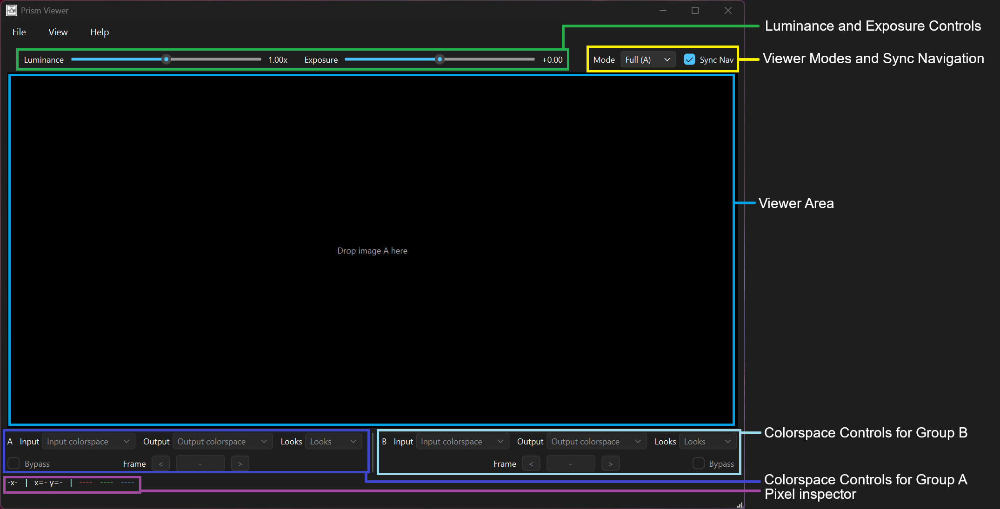


1. Open image A from `File -> Open Image A...`
2. Open image B from `File -> Open Image B...`
3. Load an OCIO config from `File -> Open OCIO Config...`

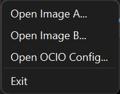

4. Select Input and Output colorspaces independently for A and B
5. Optionally select a Look
6. Switch compare modes (`Split`, `Wipe`, `Full (A)`, `Full (B)` `Diff`)

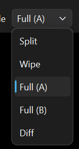

7. Hover over the viewer to inspect pixel values in the footer HUD

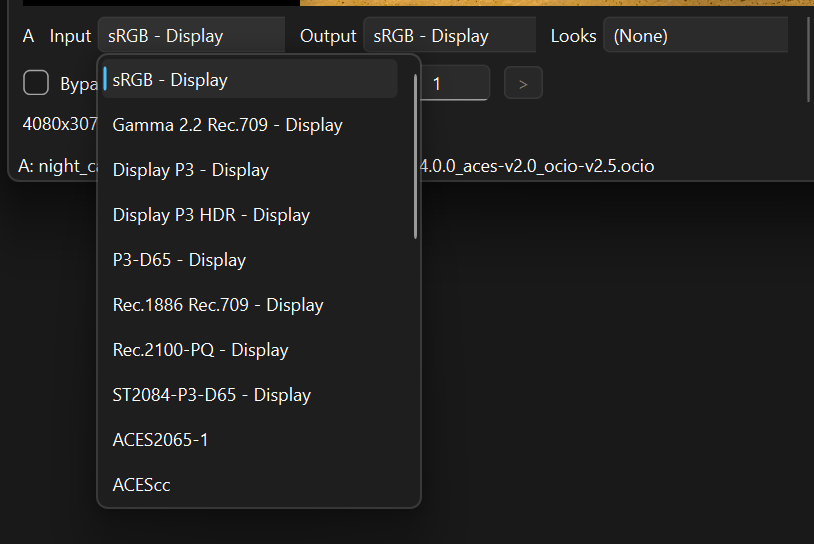

Prism also supports drag-and-drop for images and OCIO configs.

---

# Compare Modes

## Split

Shows A and B side-by-side.

Useful for:

* framing comparisons
* look validation
* general A/B review

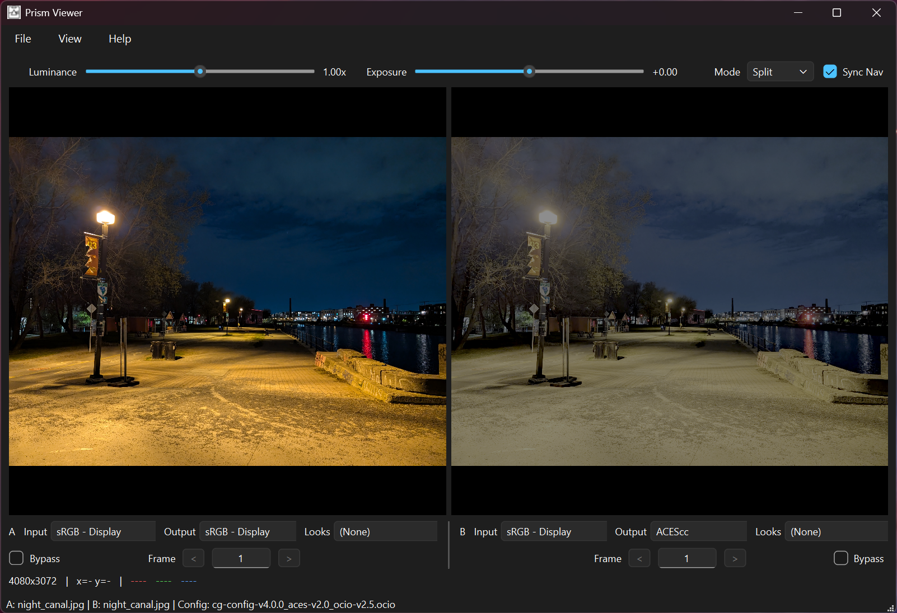

---

## Wipe

Displays A/B across an interactive divider.

Use the wipe handle to inspect transitions and subtle image differences interactively.


---

## Full

Displays only the currently selected side (`A` or `B`).

Useful for focused single-image inspection while preserving the compare setup.

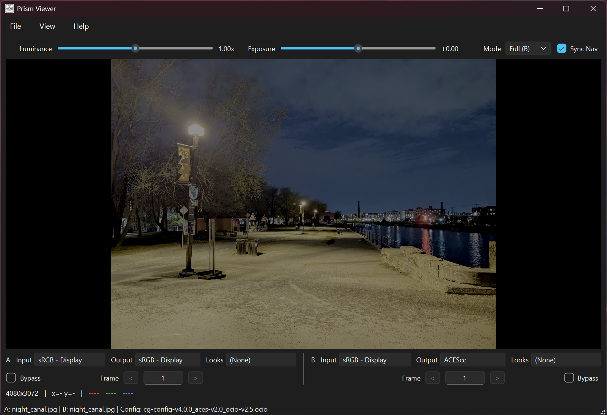

---

## Diff

Displays grayscale absolute difference between overlapping regions.

Brighter values indicate stronger differences.

Useful for:

* transform validation
* render verification
* subtle change detection

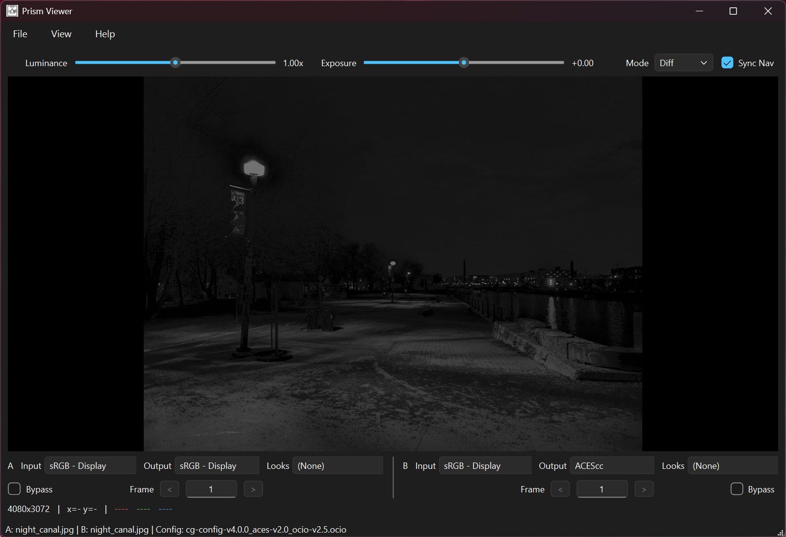

---

# OCIO Context Variables

Prism can detect and expose OCIO context variables directly from the loaded config.

Open from:

* `View -> OCIO Context Variables`
* Hotkey: `E`

Behavior:

* Hidden by default
* Dynamically rebuilds from the loaded config
* Updates processing live as values change
* Can be docked or undocked
* Persists current values while visible or hidden

This is especially useful for:

* shot-based transforms
* context-driven looks
* sequence-dependent processing
* debugging OCIO environment behavior

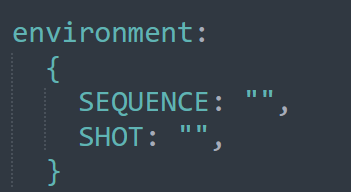

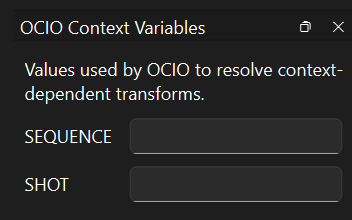

---

# Viewer Controls

## Exposure and Luminance

Interactive controls allow quick image inspection without modifying source data.

Useful for:

* shadow inspection
* highlight clipping checks
* transform debugging
* general image evaluation

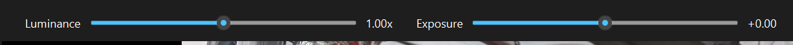

---

## Background Presets

Open from:

* `View -> Background`

Presets:

* Black
* Dark Gray
* Mid Gray
* Light Gray

Useful when image edges become difficult to read against the viewer background.

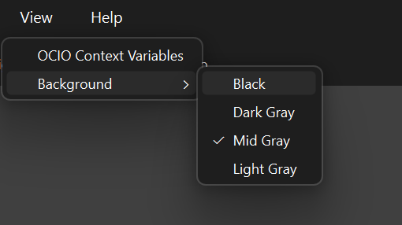

---

# LUT Inspection

Open from:

* `View -> LUT Inspection` or `Drop LUT in main_window`

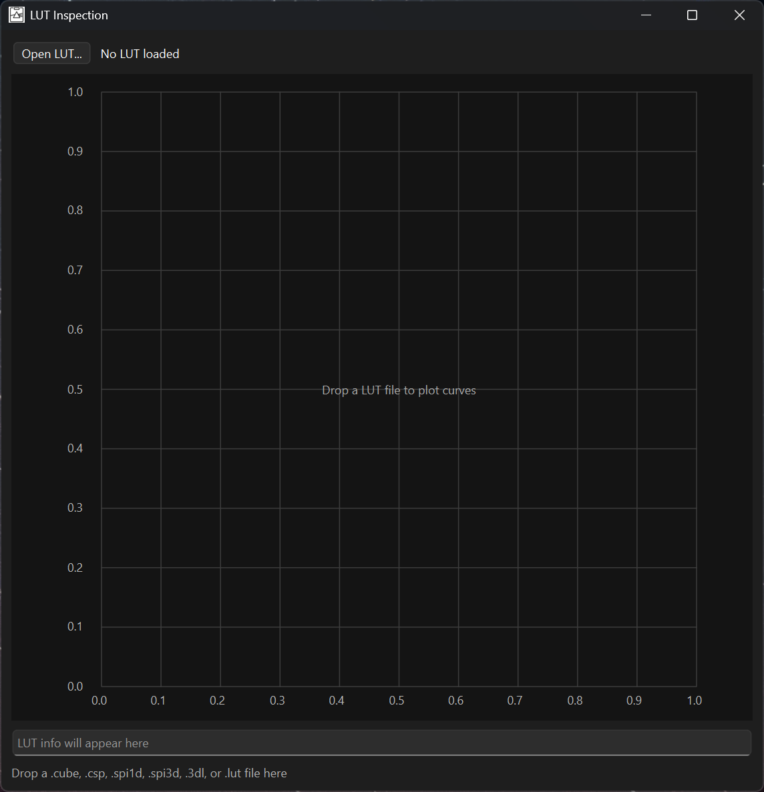

General behavior:

* opens as a modeless utility window
* accepts drag-and-drop LUT files
* supports `.cube`, `.spi1d`, `.csp`, `.spi3d`, `.lut`, and `.3dl` formats
* for `.cube`, `DOMAIN_MIN` and `DOMAIN_MAX` must use matching RGB components (mixed per-channel domain values are treated as unsupported)
* reports summary metrics including sample count, channel count, output
  min/max, out-of-range status, monotonicity, and CSP shaper status when
  available
* keeps summary analysis in core helpers and rendering in the UI layer
* does not currently display Colour/Delta E metrics; arbitrary LUT files do
  not provide a reliable source/target colourspace contract, so perceptual
  metrics are deferred until a dedicated colour-metrics workflow can state its
  assumptions explicitly

Curves tab:

* displays LUT transfer curves on an X/Y diagram that scales with window size
* for 3D LUTs, uses a neutral-axis curve projection (`R=G=B` samples)
* uses SciPy-backed trilinear sampling for shaped CSP-style 3D LUT
  neutral-axis curve inspection, while direct lattice extraction is preserved
  for unshaped 3D LUT neutral-axis curves


Volume tab:

* displays 3D LUTs as a square projected RGB point-cloud preview
* Volume controls include:
  * `Projection`: `RGB isometric`, `RG plane`, `RB plane`, or `GB plane`
  * `Position`: `Output cloud` or `Input lattice`
  * `Show neutral axis`
* plane projections use direct channel axes:
  * `RG plane`: horizontal `R`, vertical `G`
  * `RB plane`: horizontal `R`, vertical `B`
  * `GB plane`: horizontal `G`, vertical `B`
* `Output cloud` positions points by transformed LUT output RGB values, making
  LUT warping/compression visible
* `Input lattice` keeps points on the original regular RGB cube positions while
  still colouring them by transformed LUT output RGB values
* the neutral-axis overlay highlights the input grayscale diagonal (`R=G=B`)
  over the volume preview
* large 3D LUTs are automatically decimated for preview responsiveness; the
  status text reports rendered samples versus total volume samples


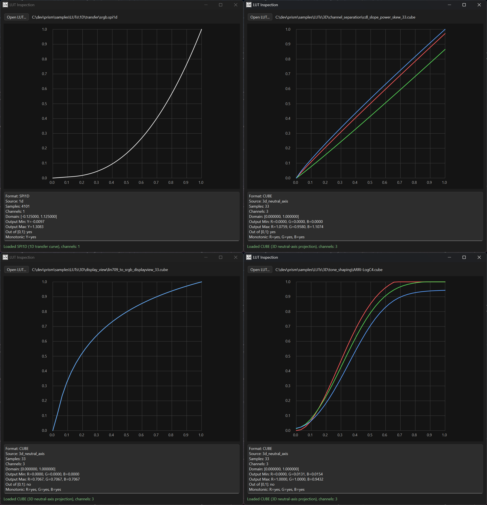
---

# Waveform Monitor

Open from:

* `View -> Monitoring -> Waveform Monitor`

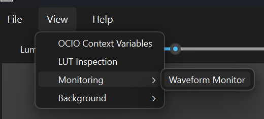

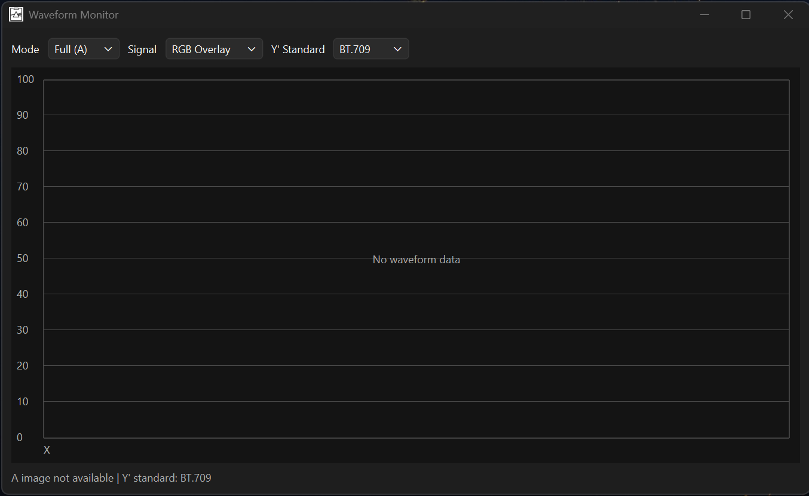

Behavior:

* opens as a modeless utility window
* inspects each side's float RGB analysis buffer:
  * post-OCIO output when a transform is active
  * loaded source data when transform setup is incomplete or bypassed
  * before global exposure/luminance and channel-view presentation controls
* source modes mirror main viewer compare naming:
  * `Full (A)`
  * `Full (B)`
  * `Split`
* source mode is synchronized with main compare mode for supported modes:
  * changing mode in waveform updates main viewer mode
  * changing main viewer mode updates waveform mode
  * opening waveform initializes from current main mode
  * this is intentional: the waveform monitor can be used as a compact control
    surface for changing the active viewer comparison state
* `Wipe` and `Diff` are currently unsupported in waveform mode mapping:
  * waveform shows blank graphs with an explicit unsupported-mode message
* signal display options:
  * `R`
  * `G`
  * `B`
  * `RGB Parade`
  * `RGB Overlay`
  * `Y'` with selectable `BT.709` or `BT.2020` encoded-signal weights
    * defaults to `BT.709`
    * the standard is selected explicitly and is not inferred from OCIO names
    * `Y'` is an encoded weighted signal, not scene-linear or absolute luminance


* applies a small SciPy Gaussian filter to rendering copies for trace
  readability; raw waveform density data remains unchanged
* supports drag-and-drop image loading directly from waveform:
  * `Full (A)` drops load side `A`
  * `Full (B)` drops load side `B`
  * `Split` drops route by pane (`left -> A`, `right -> B`)
  * dropped images are loaded into the main viewer, so waveform and viewer state
    remain synchronized

---

# Diagnostics

Prism includes a diagnostics window for quickly validating runtime dependencies and OCIO environment state.

Includes:

* Prism version
* Python version
* Qt / PySide version
* NumPy version
* OpenImageIO version
* OpenColorIO version
* Active OCIO config
* Platform information

Useful for:

* support,
* debugging,
* pipeline validation,
* environment troubleshooting.

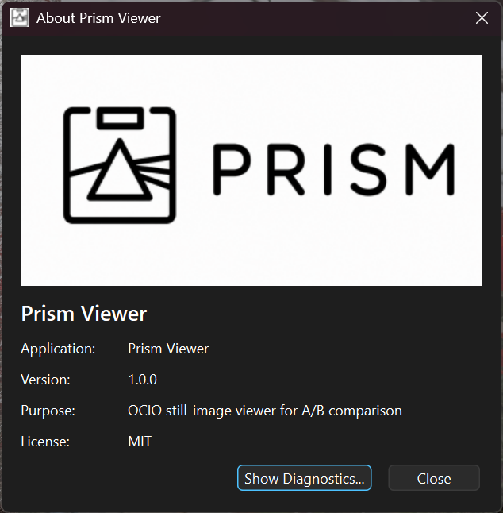
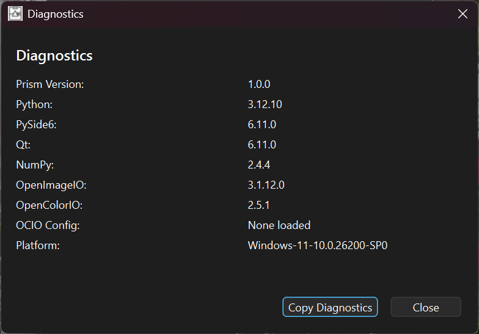

---

# Typical Workflows

## A/B Grade Validation

1. Load image A and B
2. Load an OCIO config
3. Configure Input and Output transforms
4. Start in `Split`
5. Move to `Wipe` for edge comparison
6. Use `Diff` to isolate subtle changes

---

## Single Image Inspection

1. Load image A
2. Configure transforms
3. Switch to `Full`
4. Inspect pixel values and channels
5. Adjust exposure and luminance interactively

---

## Context-Based Look Debugging

1. Load image and OCIO config
2. Open `View -> OCIO Context Variables`
3. Modify context values
4. Observe updates live in the viewer

---

# Hotkeys

* `F` Fit to Window
* `H` Show/Hide Hotkeys dialog
* `E` Toggle OCIO Context Variables dock
* `Tab` Switch active side A/B
* `Right` / `PageDown` Next frame
* `Left` / `PageUp` Previous frame
* `Up` / `Down` Change focused Input/Output item
* `R` Toggle Red solo / RGB
* `G` Toggle Green solo / RGB
* `B` Toggle Blue solo / RGB
* `Z` Restore RGB
* `1 / 2 / 3 / 4 / 5`

  * Split
  * Wipe
  * Full (A)
  * Full (B)
  * Diff
* `Right Click + Drag` Pan

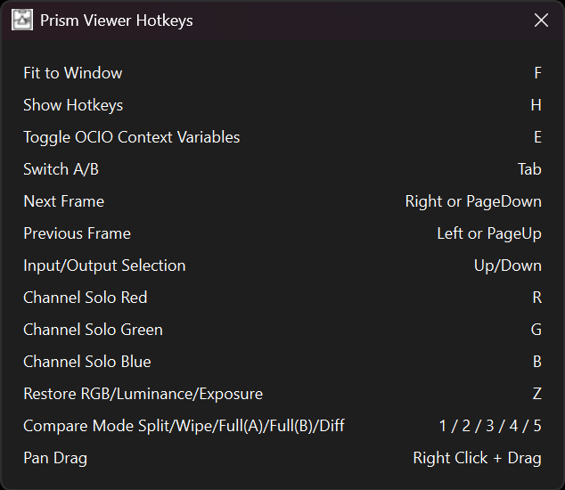

---

# Sample Assets

Prism includes sample files to validate setup quickly:

* Sample images: `samples/images/`
* Sample OCIO config: `samples/ocio_config/`
* Sample LUTs: `sample/LUTs`

Quick smoke test:

1. Launch `prism`
2. Load image A and B from `samples/images/`
3. Load config from `samples/ocio_config/`
4. Switch between `Split`, `Wipe`, `Full (A)`, `Full (B)`, and `Diff`

---

# Troubleshooting

## `prism` command not found

Activate the intended virtual environment and reinstall from repository root:

```powershell
python -m pip install -e .
```

---

## OCIO config fails to load

* Confirm `OpenColorIO` is installed in the active environment
* Confirm the selected file is a valid `.ocio` config
* If loading is canceled intentionally, Prism preserves current state

---

## EXR or DPX images fail to load

Prism uses OpenImageIO fallback support for formats that may not be available through Qt directly.

Verify:

* `OpenImageIO` is installed
* the active environment can import it successfully

---

## Movie source issues

Movie playback depends on optional backend availability such as:

* `opencv-python`
* `imageio[ffmpeg]`

Still-image workflows remain fully functional without them.

---

# Known Limitations

* Movie workflows remain backend/environment dependent
* Some EXR/DPX workflows rely on OpenImageIO fallback support
* Windows taskbar icon refresh may lag behind icon updates until Explorer refreshes shell cache

---

# Planned Features

* Vectorscope
* Chromaticity Diagram and gamut visualization
* Transform breakdown visualization
* Nuke integration
* Resolve integration
* More Display/View support

---

## Architecture and Developer Docs

See [docs/README.md](./docs/README.md) for subsystem and architecture documentation:

- [Architecture](./docs/architecture.md)
- [Core](./docs/core.md)
- [I/O](./docs/io.md)
- [UI](./docs/ui.md)
- [OCIO Context](./docs/ocio-context.md)
- [Packaging](./docs/packaging.md)
